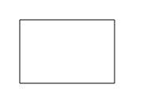
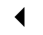
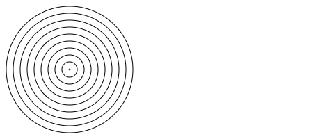
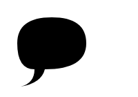
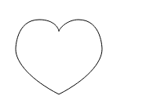

# 绘制形状

`canvas` 的起点为左上角（坐标为（0,0）），所有元素的位置都相对于原点定位。
所以图中蓝色方形左上角的坐标为距离左边（X轴）x像素，距离上边（Y轴）y像素（坐标为（x,y））  


1. 矩形（Rectangular）

`canvas`提供了四种`API`方法绘制矩形：

* rect(x, y, width, height) 绘制一个左上角坐标为（x,y）的矩形
* fillRect(x, y, width, height) 绘制一个填充的矩形
* strokeRect(x, y, width, height) 绘制一个矩形的边框
* clearRect(x, y, width, height) 清除指定矩形区域，让清除部分完全透明。

**x与y指定了在canvas画布上所绘制的矩形的左上角（相对于原点）的坐标，width和height设置矩形的尺寸。**

```js
var canvas = document.getElementById('canvas');
var ctx = canvas.getContext('2d');
ctx.fillRect(25,25,100,100);
ctx.clearRect(45,45,60,60);
ctx.strokeRect(50,50,50,50);
```

```js
<script type="text/javascript">
var canvas=document.getElementById('canvas');
var ctx=canvas.getContext('2d');
ctx.beginPath();
ctx.rect(25,25,120,80);
ctx.stroke();
</script>
```

`fillRect()`函数绘制了一个边长为100px的正方形(默认黑色)。`clearRect()`函数从正方形的中心开始擦除了一个60*60px的正方形，接着`strokeRect()`在清除区域内生成一个50*50的正方形边框。




### 绘制路径

图形的基本元素是路径。路径通过不同颜色和宽度的线段或曲线相连,形成不同形状的点的集合,且路径都是闭合的。

1. 创建路径起始点。
2. 使用画图命令去画出路径。
3. 把路径封闭。
4. 路径生成后，通过描边或填充路径区域来渲染图形

绘制路径的API ：

* beginPath() 新建一条路径，生成之后，图形绘制命令被指向到路径上生成路径。
* stroke()通过线条来绘制图形轮廓。
* closePath() 闭合路径之后图形绘制命令又重新指向到上下文中。
* fill() 通过填充路径的内容区域生成实心的图形。


**第一条路径构造命令通常是`moveTo（）`，开始路径之后,需移动到起始位置。**

**当调用`fill()`函数时，所有没有闭合的形状都会自动闭合，不需要调用`closePath()`函数。但是调用`stroke()`时不会自动闭合。**

```js
var canvas=document.getElementById('canvas');
var ctx=canvas.getContext('2d');
ctx.beginPath();
ctx.moveTo(80,40);
ctx.lineTo(100,60);
ctx.lineTo(100,20);
ctx.fill();
```  




```js
var canvas=document.getElementById('canvas');
var ctx=canvas.getContext('2d');
// 填充三角形
ctx.beginPath();
ctx.moveTo(25,25);
ctx.lineTo(105,25);
ctx.lineTo(25,105);
ctx.fill();

// 描边三角形
ctx.beginPath();
ctx.moveTo(125,125);
ctx.lineTo(125,45);
ctx.lineTo(45,125);
ctx.closePath();
ctx.stroke();

```
圆弧
绘制圆弧或者圆，我们使用arc()方法。其API 为：
`arc(x, y, radius, startAngle, endAngle, anticlockwise)`
画一个以`（x,y）`为圆心，以`radius`为半径的圆弧（圆），从`startAngle`开始到`endAngle`结束，按照`anticlockwise`给定的方向（默认为顺时针 `false`）来生成。

**`arc()`函数中的角度单位是弧度，不是度数。角度与弧度的js表达式:radians=(Math.PI/180)`*`degrees。**

```js
var canvas=document.getElementById('canvas');
var ctx=canvas.getContext('2d');
for(var j=0;j<5;j++){
    ctx.beginPath();
    var x=100;
    var y=100;
    var radius=1+10*j;
    var startAngle=0;
    var endAngle=Math.PI*2;
    ctx.arc(x,y,radius,startAngle,endAngle);
    ctx.stroke();
}

```   



### 二次贝塞尔曲线及三次贝塞尔曲线
二次及三次贝塞尔曲线都十分有用，一般用来绘制复杂有规律的图形。其API如下：

* `quadraticCurveTo(cp1x, cp1y, x, y)` 绘制二次贝塞尔曲线，`cp1x`,`cp1y`为一个控制点，`x`,`y`为结束点。
* `bezierCurveTo(cp1x, cp1y, cp2x, cp2y, x, y)` 绘制三次贝塞尔曲线，`cp1x`,`cp1y`为控制点一，`cp2x`,`cp2y`为控制点二，x,y为结束点。
下面的图能够很好的描述两者的关系，二次贝塞尔曲线有一个开始点（蓝色）、一个结束点（蓝色）以及一个控制点（红色），而三次贝塞尔曲线有两个控制点。

参数x、y在这两个方法中都是结束点坐标。`cp1x`,`cp1y`为坐标中的第一个控制点，`cp2x`,`cp2y`为坐标中的第二个控制点。

二次贝塞尔曲线例子  



```js
<script type="text/javascript">
var canvas=document.getElementById('canvas');
var ctx=canvas.getContext('2d');
ctx.beginPath();
ctx.moveTo(75,25);
ctx.quadraticCurveTo(25,25,25,62.5);
ctx.quadraticCurveTo(25,100,50,100);
ctx.quadraticCurveTo(50,120,30,125);
ctx.quadraticCurveTo(60,120,65,100);
ctx.quadraticCurveTo(125,100,125,62.5);
ctx.quadraticCurveTo(125,25,75,25);
ctx.fill();
</script>
```

三次贝塞尔曲线  



```js
<script type="text/javascript">
var canvas=document.getElementById('canvas');
var ctx=canvas.getContext('2d');
ctx.beginPath();
ctx.moveTo(75,25);
ctx.quadraticCurveTo(25,25,25,62.5);
ctx.quadraticCurveTo(25,100,50,100);
ctx.quadraticCurveTo(50,120,30,125);
ctx.quadraticCurveTo(60,120,65,100);
ctx.quadraticCurveTo(125,100,125,62.5);
ctx.quadraticCurveTo(125,25,75,25);
ctx.fill();
</script>
```

### Path2D 对象
Path2D对象已可以在较新版本的浏览器中使用，用来缓存或记录绘画命令，这样能快速地回顾路径。

`Path2D()`会返回一个新初始化的`Path2D`对象（可能将某一个路径作为变量——创建一个它的副本，或者将一个包含`SVG path`数据的字符串作为变量）。
```js
new Path2D();     // 空的Path对象
new Path2D(path); // 克隆Path对象
new Path2D(d);    // 从SVG建立Path对象
```
所有的路径方法比如moveTo, rect, arc或quadraticCurveTo等都可以在Path2D中使用。

### Path2D 示例

我们创造了一个矩形和一个圆。它们都被存为Path2D对象，后面再派上用场。随着新的Path2D API产生，几种方法也相应地被更新来使用Path2D对象而不是当前路径。在这里，带路径参数的stroke和fill可以把对象画在画布上。
```js
var canvas=document.getElementById('canvas');
var ctx=canvas.getContext('2d');
var rectangle = new Path2D();
rectangle.rect(10, 10, 50, 50);// 绘制矩形

var circle = new Path2D();
circle.moveTo(125, 35);
circle.arc(100, 35, 25, 0, 2 * Math.PI);// 绘制圆形

var angle=new Path2D(); //绘制三角形
angle.moveTo(130,10);
angle.lineTo(190,10);
angle.lineTo(160,50);
angle.closePath()

ctx.stroke(rectangle);
ctx.fill(circle);
ctx.stroke(angle);
```  

