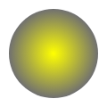
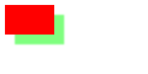

## 添加颜色 
给图形上色，有两个重要的属性可以做到：fillStyle 和 strokeStyle。

* fillStyle = color 设置图形的填充颜色。
* strokeStyle = color 设置图形轮廓的颜色。

color 可以是表示 CSS 颜色值的字符串，渐变对象或者图案对象。默认情况下，
线条和填充颜色都是黑色（CSS 颜色值 #000000）。

**一旦您设置了 strokeStyle 或者 fillStyle 的值，那么这个新值就会成为新绘制的图形的默认值。如果你要给每个图形上不同的颜色，你需要重新设置 fillStyle 或 strokeStyle 的值。**

fillStyle 示例

```js
var ctx = document.getElementById('canvas').getContext('2d');
  for (var i=0;i<6;i++){
    for (var j=0;j<10;j++){
      ctx.fillStyle = 'rgb(' + Math.floor(255-42.5*i) + ',' + 
                       Math.floor(255-22.5*j) + ',0)';
      ctx.fillRect(j*25,i*25,25,25);
    }
  }
```


strokeStyle 示例

```js
var ctx = document.getElementById('canvas').getContext('2d');
    for (var i=0;i<6;i++){
      for (var j=0;j<10;j++){
        ctx.strokeStyle = 'rgb(0,' + Math.floor(255-42.5*i) + ',' + 
                         Math.floor(255-22.5*j) + ')';
        ctx.beginPath();
        ctx.arc(12.5+j*25,12.5+i*25,10,0,Math.PI*2,true);
        ctx.stroke();
      }
    }
```


### 透明度 Transparency

可以用 `canvas` 来绘制半透明的图形。通过设置 `globalAlpha` 属性或者使用一个半透明颜色作为轮廓或填充的样式。
`globalAlpha = transparencyValue` 这个属性影响到 `canvas` 里所有图形的透明度，有效的值范围是 0.0 （完全透明）到 1.0（完全不透明），默认是 1.0。`globalAlpha` 属性在需要绘制大量拥有相同透明度的图形时候相当高效。
由于`strokeStyle` 和 `fillStyle` 属性接受符合 `CSS3` 规范的颜色值，我们可以用`rgba()` 方法来设置具有透明度的颜色。

```js
var ctx = document.getElementById('canvas').getContext('2d');
// 画背景
ctx.fillStyle = '#FD0';
ctx.fillRect(0,0,75,75);
ctx.fillStyle = '#6C0';
ctx.fillRect(75,0,75,75);
ctx.fillStyle = '#09F';
ctx.fillRect(0,75,75,75);
ctx.fillStyle = '#F30';
ctx.fillRect(75,75,75,75);
ctx.fillStyle = '#FFF';

// 设置透明度值
ctx.globalAlpha = 0.3;

// 画半透明圆
for (var i=0;i<7;i++){
    ctx.beginPath();
    ctx.arc(75,75,1+10*i,0,Math.PI*2,true);
    ctx.fill();
}
```


### 线型 Line styles
* lineWidth = value 设置线条宽度。属性值必须为正数。默认值是1.0。
  * 线宽是指给定路径的中心到两边的粗细,就是在路径的两边各绘制线宽的一半,实际上画布的坐标并不和像素直接对应。
* lineCap = type 设置线条末端样式，默认是 butt。
  * lineCap 属性的值决定了线段端点显示的样子。它可以为下面的三种之一：butt，round 和 square。。
* lineJoin = type 设定线条与线条间接合处的样式，默认是 miter。
  * lineJoin 它可以是这三种之一：round, bevel 和 miter。
* miterLimit = value 限制当两条线相交时交接处最大长度；所谓交接处长度（斜接长度）是指线条交接处内角顶点到外角顶点的长度。
* getLineDash() 返回一个包含当前虚线样式，长度为非负偶数的数组。
* setLineDash(segments) 设置当前虚线样式。
* lineDashOffset = value 设置虚线样式的起始偏移量。


lineWidth|lineCap|lineJoin|miterLimit|
:--:|:--:|:--:|:--:|:--:
||||

使用虚线 setLineDash 方法和 lineDashOffset 属性来制定虚线样式. setLineDash 方法接受一个数组，来指定线段与间隙的交替,lineDashOffset 属性设置起始偏移量.

```js
var ctx = document.getElementById('canvas').getContext('2d');
var offset = 0;

function draw() {
  ctx.clearRect(0,0, canvas.width, canvas.height);
  ctx.setLineDash([4, 2]);
  ctx.lineDashOffset = -offset;
  ctx.strokeRect(10,10, 100, 100);
}

function march() {
  offset++;
  if (offset > 16) {
    offset = 0;
  }
  draw();
  setTimeout(march, 20);
}
march();
```
### 渐变 Gradients

* `createLinearGradient(x1, y1, x2, y2)`
`createLinearGradient` 方法接受 4 个参数，表示渐变的起点 `(x1,y1)` 与终点 `(x2,y2)`。
* `createRadialGradient(x1, y1, r1, x2, y2, r2)`
`createRadialGradient` 方法接受 6 个参数，前三个定义一个以 `(x1,y1)` 为原点，半径为 `r1` 的圆，后三个参数则定义另一个以 `(x2,y2)` 为原点，半径为 `r2` 的圆。

创建出 `canvasGradient `对象后，我们就可以用 `addColorStop `方法给它上色了。`gradient.addColorStop(position, color)`
`addColorStop `方法接受 2 个参数，`position` 参数必须是一个 `0.0` 与 `1.0` 之间的数值，表示渐变中颜色所在的相对位置。例如，`0.5` 表示颜色会出现在正中间。`color` 参数必须是一个有效的` CSS `颜色值（如 `#FFF`， `rgba(0,0,0,1)`，等等）。

createLinearGradient|createRadialGradient|createPattern
--|--|--
||

### 图案样式 Patterns
`createPattern(image, type)` 该方法接受两个参数。`Image `可以是一个 `Image` 对象的引用，或者另一个 `canvas` 对象。`Type` 必须是下面的字符串值之一：`repeat，repeat-x，repeat-y` 和` no-repeat`。

**需要确认 image 对象已经加载完毕，否则可能效果不对。**
```js
var canvas = document.getElementById('canvas');
var ctx = canvas.getContext('2d');
var img = new Image();
img.src = "./imgs/canvas022.png";
img.onload = function () {
    var ptrn = ctx.createPattern(img, 'repeat');
    ctx.fillStyle = ptrn;
    ctx.fillRect(0, 0, 300, 150);
}
```
### 阴影 Shadows
`shadowOffsetX = float` `shadowOffsetX`用来设定阴影在X轴的延伸距离,负值表示阴影会往左延伸,正值则表示会往右延伸,默认为 0。
`shadowOffsetY = float` `shadowOffsetY`用来设定阴影在Y轴的延伸距离,负值表示阴影会往上或左延伸,正值则表示会往下,默认为 0。
`shadowBlur = float` `shadowBlur` 用于设定阴影的模糊程度,其数值并不跟像素数量挂钩,默认为 0。
`shadowColor = color` `shadowColor` 是标准的 CSS 颜色值,用于设定阴影颜色效果，默认是全透明的黑色。
```js
var ctx = document.getElementById('canvas').getContext('2d');
ctx.shadowOffsetX = 20;
ctx.shadowOffsetY = 20;
ctx.shadowBlur = 4;
ctx.shadowColor = "rgba(0, 255, 0, 0.5)";
ctx.fillStyle = "red";
ctx.fillRect(10,10,100,60);
```


### Canvas 填充规则
用 `fill`（或者 `clip`和`isPointinPath` ）可以选择一个填充规则,该填充规则根据某处在路径的外面或者里面来决定该处是否被填充.
两个可能的值： 默认值: `nonzero`; `evenodd`
```js
 var ctx = document.getElementById('canvas').getContext('2d'); 
ctx.beginPath(); 
ctx.arc(50, 50, 30, 0, Math.PI*2, true);
ctx.arc(50, 50, 15, 0, Math.PI*2, true);
ctx.fill("evenodd");
ctx.closePath()

ctx.beginPath();
ctx.arc(160,50,30,0,Math.PI*2,false);
ctx.arc(160,50,15,0,Math.PI*2,false);
ctx.fill("nonzero")

```


